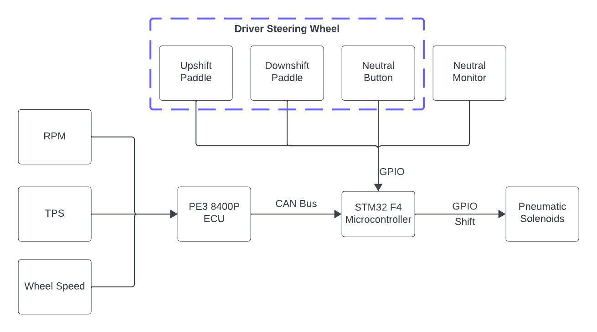
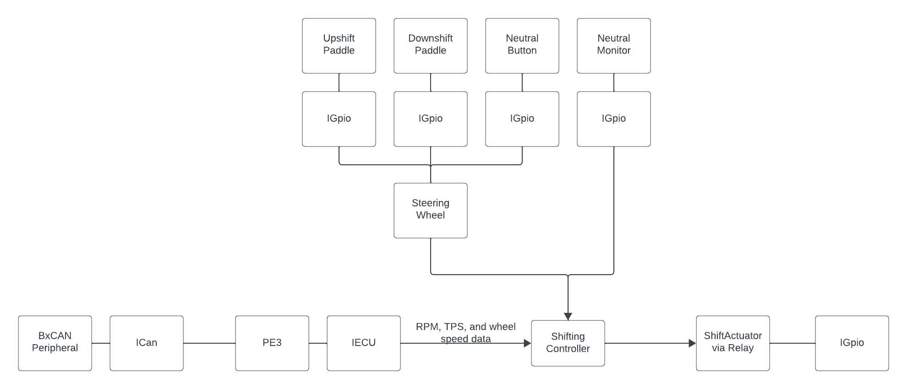
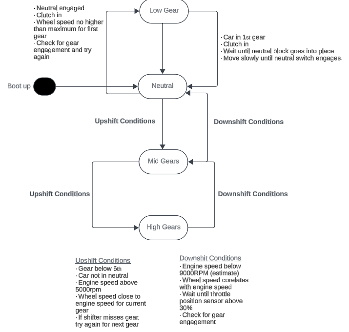

# PneumaticPaddleShifting

## Table of Contents
1. [Objective](#objective)
2. [User Features](#user-features)
3. [Hardware and Equipment](#hardware-and-equipment)
4. [Firmware Tech Stack](#firmware-tech-stack)
5. [Automation](#automation)
6. [Design](#design)

## Objective:
- Optimize the user's response to a down-shift and up-shift command.
- Maintain strict practices and edge cases for critical safety.
- Build the first fully-fledged DAQ with re-usable code through:
    - The Layered Architecture design pattern
    - Modularity of components
    - Hardware abstraction

## User Features
| Supported Logging Method | Library Completion    |
| :----------------------- | :--------------------:|
| Micro-SD Card            |                       |
| USB Flash Drive          | &#10004; |
| Wireless Transmission    |                       |

## Hardware and Equipment
### Target Device
The [STM32 Nucleo F466RE](https://www.st.com/en/evaluation-tools/nucleo-f446re.html) microcontroller development board is used as the current target device for code merged to the `main` and `develop` branches. Theoretically, other Arm Cortex M4 based STM32 devices with the necessary peripherals should be able to run the same program.

## Firmware Tech Stack
- STM32 Hardware Abstraction Layer ([HAL](https://www.st.com/resource/en/user_manual/um1725-description-of-stm32f4-hal-and-lowlayer-drivers-stmicroelectronics.pdf))
  - Generated by STM32CubeMX within the CubeIDE environment, which also provides the `arm-none-eabi` toolchain.
  - Serves as a set of drivers or a Board Support Package (BSP) to interface with the microcontroller.

## Automation
- Unit tests are developed using [Google Test](https://google.github.io/googletest/) and are maintained in `Shifter_System/Tests`.
- See our [Unit Testing page](https://github.com/DallasFormulaRacing/DataAcquisition2.0/wiki/Unit-Testing) for running them locally by leveraging [Docker](https://docs.docker.com/get-started/overview/).
- Continuous Integration (CI)
  - The firmware is compiled as an stm32CubeIDE project using the following GitHub Action: [xanderhendriks/action-build-stm32cubeide](https://github.com/marketplace/actions/build-stm32cubeide-project).
  - The unit tests are compiled and ran using [CMake](https://cmake.org/cmake/help/latest/index.html) with [Ninja](https://ninja-build.org/manual.html). 

## Design

High level system diagram:

Firmware design:

### User Input

It is assumed that the user inputs are simple GPIO signals (i.e., high and low voltages). The upshift and downshift paddle will request their respective shift. The neutral button is for the user to set the car into neutral, and this may be verified with a neutral “monitor”. The neutral monitor is to act as some sort of sensor or switch.  

Do note, however, that these inputs have not yet been tested. It is currently unknown whether they will require any signal “debouncing” so that the behavior is not jittery or sporadic. It has also been highly recommended to consider more fail-safe mechanisms for the scenario that the user input begins to malfunction. 

### Reading ECU Data

The device reads RPM, TPS, and wheel speeds from the PE3 8400-P ECU. This ECU implementation library was adopted from the race team’s previous efforts in other projects. 

### Shift Controller

The Shift Controller is a high-level component responsible for evaluating the driver’s shift requests. It depends on an ECU and several GPIO components to be used. Internally, a state machine is used to perform different behaviors. This approach offers the following advantages: dramatically simplifies the logic, increases performance, isolated behavior, and transition actions. The performance is increased as it only performs the conditional checks that are unique to each state. Due to the isolated behaviors, we can also easily determine and rigorously test every edge case for every state.

You may see the design of the state machine below in Figure 9. In practice, there are 6 gears. However, gears 2 through 5 had the same logic and state transition conditions, so they were condensed into a single state. So, the nomenclature was established as the following: Low Gear refers to first gear, Mid Gears refers to second to fifth gear, and High Gear refers to sixth gear. 

One important design choice is how we intended to manage the transition to/from the neutral state. In practice, to go from first to second gear, the driver typically needs to go through neutral. Although an “immediate pass-through" transition was considered, the team ultimately decided to require the driver to manually transition through neutral. This user experience will be in reminiscence of a typical vehicle to offer a more seamless and practical learning curve to use. 

It is worth mentioning that, due to time constraints in the development of the Shift Actuation, the Shift Controller is incomplete in respect to commanding for a shift. 

`ShiftController` state machine:

### Shift Actuation

It is assumed that the required hardware interface for the shift actuator would be a GPIO (i.e., high and low) signal. However, due to time constraints, requirements of the hardware interface were not tested and verified for modifications. 
